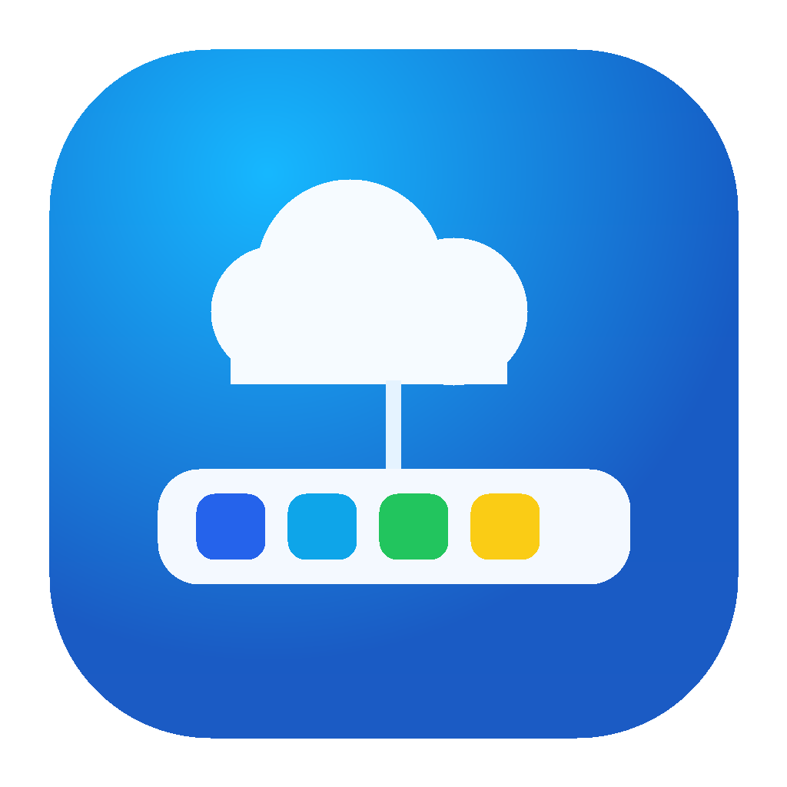

  

<h1 align="center">CloudDock</h1>

  <strong>앱, 음악, 시스템 정보. 나만의 macOS 위젯 독.</strong> 
  Your apps, music, and system stats. One personal macOS widget dock.

  <a href="https://github.com/newstars/clouddock/releases">DMG 다운로드 / Downloads</a> ·
  <a href="#기능-현황--feature-status">기능 / Features</a> ·
  <a href="https://github.com/newstars/clouddock/issues">피드백 / Feedback</a>

  
  
  

실제 실행 화면입니다. 표시 위젯과 순서는 직접 구성할 수 있습니다. Captured from the running app. Choose your widgets and arrange them your way.

## 내 Mac에 맞게 / Make It Yours

| 자주 쓰는 앱을 가까이 / Apps Within Reach | 음악은 흐름을 끊지 않게 / Music Without Switching | 필요한 정보만 한눈에 / Useful Stats at a Glance |
| --- | --- | --- |
| 앱을 그룹으로 묶고 아이콘을 원하는 순서로 배치하세요. / Group your apps and arrange icons in your own order. | 독의 작은 팝업에서 Apple Music 재생을 제어하세요. / Control Apple Music from a compact dock popover. | CPU·메모리와 로컬 Git 상태를 필요한 위젯으로 구성하세요. / Pick widgets for CPU, memory, and local Git status. |

쓰고 싶을 때 열고, 집중할 때 숨기세요. macOS Dock의 CloudDock 아이콘으로 전환할 수 있습니다.

Bring it up when you need it. Hide it when you want to focus. Toggle CloudDock from its macOS Dock icon.

> **개발 프리뷰 / Development Preview**: 코드·보안·성능 감사가 진행 중입니다. 안정 버전이나 저부하 보장을 의미하지 않습니다. Release-readiness, security, and performance auditing is ongoing; stability and low resource usage are not yet verified guarantees.

## 다운로드 및 설치 / Download & Install

일반 사용자는 빌드 없이 **[GitHub Releases](https://github.com/newstars/clouddock/releases)**의 공개 릴리스에서 `.dmg`를 내려받습니다. 공개된 DMG가 없으면 아직 배포 전입니다. 초안과 Actions 산출물은 공개 릴리스가 아닙니다.

Download a `.dmg` from a published **[GitHub Release](https://github.com/newstars/clouddock/releases)** without building the source. If none is listed, distribution is not ready yet. Drafts and Actions artifacts are not public releases.

1. macOS 14 이상에서 DMG를 엽니다. / Open the DMG on macOS 14 or later.
2. `CloudDock.app`을 `Applications`로 드래그합니다. / Drag the app into `Applications`.
3. Applications에서 실행하고 macOS Dock의 CloudDock 아이콘으로 표시·숨김을 전환합니다. / Launch from Applications; toggle visibility with the CloudDock icon in the macOS Dock.

`universal`: Apple Silicon 및 Intel / Apple Silicon and Intel. `arm64`: Apple Silicon 전용 / only. `x86_64`: Intel용 / Intel. 실제 기기별 검증 범위는 릴리스 노트를 확인하세요. / See release notes for hardware actually tested.

**현재 개발용 임시 서명(ad-hoc)이며 Apple 공증이 없습니다.** DMG 자체가 공증을 제공하지 않으며 macOS가 다운로드한 앱을 차단할 수 있습니다. Gatekeeper 전역 해제는 권하지 않습니다.

**Current packaging is ad-hoc signed, not Apple-notarized.** DMG packaging does not provide notarization; macOS may block downloaded builds. We do not recommend globally disabling Gatekeeper.

## 기능 현황 / Feature Status

'구현됨'은 코드 존재를 뜻하며 모든 환경에서 검증 완료되었다는 뜻은 아닙니다. / “Implemented” does not mean verified on every device or account.

| 기능 / Feature | 상태·제한 / Status & Limitations |
| --- | --- |
| 위젯 독 / Widget dock | 구현됨: 줄바꿈, 위치, 표시·숨김, 순서 변경. 다중 모니터·드래그 회귀 검증 진행 중. / Implemented; multi-monitor and drag regression testing ongoing. |
| 앱·그룹 / Apps & groups | 앱 추가, 2×2 그룹 미리보기, 실행 구현됨. / Custom apps, group previews, and launching implemented. |
| 파일·폴더 / Files & folders | 로컬 경로 즐겨찾기 구현됨. 이동·삭제·권한 제한 시 열기 실패 가능. / Local-path favorites implemented; moved/deleted/inaccessible items may fail to open. |
| 실행 중 앱 / Running apps | 일반 앱 목록·전환 구현됨. / Regular-app listing and switching implemented. |
| 시계·세계시계·날짜 / Clocks & date | 현재 시각 및 여러 시간대 구현됨. / Local time and multiple time zones implemented. |
| 포모도로 / Pomodoro | 기본 타이머 구현됨. / Basic focus timer implemented. |
| CPU·메모리 / CPU & memory | 사용량·프로세스 목록·확인 후 SIGTERM 요청 구현됨. 종료는 대상에 따라 실패 가능. 메모리 사용량은 메모리 압력과 다름. / Usage, process lists, and confirmed SIGTERM requests implemented; termination may fail. Usage is not memory pressure. |
| 네트워크·디스크·배터리 / Network, disk & battery | 로컬 통계 구현됨. 정확도·장시간 갱신 검증 진행 중. / Local statistics implemented; accuracy and long-running refresh checks ongoing. |
| 클립보드 / Clipboard | 160자 미리보기 10개를 메모리에 보관. 원문 전체 복원 아님; 민감정보 탐지는 불완전. / Ten in-memory text previews capped at 160 characters, not full-text restoration; sensitive-text detection is heuristic. |
| 메모 / Notes | 로컬 간단 메모. Apple Notes 동기화 아님. / Local quick note, not Apple Notes sync. |
| 캘린더 / Calendar | EventKit 일정 조회 구현됨. macOS 권한 필요. / EventKit viewing implemented; permission required. |
| 음량·출력 / Audio | CoreAudio 제어 구현됨. 일부 외부 장치는 소프트웨어 음량 미지원. / CoreAudio controls implemented; some devices do not support software volume. |
| 날씨 / Weather | Open-Meteo 현재 날씨·도시 검색·여러 도시 저장. 인터넷 필요; Apple Weather 데이터 아님. / Open-Meteo current conditions/search/saved cities; internet required, not Apple Weather data. |
| Apple Music | 재생 제어·자켓 구현 및 로컬 재생 UI 확인. 자동화 권한과 재생할 곡 필요. / Playback controls/artwork implemented with local playback UI checked; Automation permission and playable content required. |
| Git | 여러 로컬 저장소 상태 구현됨. 자동 fetch 없음. / Multiple local repositories implemented; no auto-fetch, tracking reflects the last fetch. |
| Datadog | API·Application Key 모니터 조회 코드 구현, Keychain 저장. 실제 계정 검증 미완료, OAuth 미구현. / Keychain-backed monitor reader implemented; live-account validation incomplete, no OAuth. |
| 로그인 시 실행 / Launch at login | 등록 구현됨. 설치 경로·macOS 승인에 따라 동작. / Registration implemented; depends on installation path and macOS approval. |

### 미구현 / Not Implemented

GitHub PR·알림, Kubernetes, AWS, 매출 위젯은 계획 항목이며 사용 가능한 기능이 아닙니다. Claude Code·ChatGPT 사용량, Datadog OAuth, 자동 업데이트도 미구현입니다.

GitHub PRs/notifications, Kubernetes, AWS, and revenue widgets are planned, not available. Claude Code/ChatGPT usage, Datadog OAuth, and automatic updates are also not implemented.

### 성능·개인정보 / Performance & Privacy

독이 숨겨지면 공유 루프의 시스템 통계·Git·프로세스 조회를 중단하고, 표시 중에도 켜진 위젯만 갱신합니다. 이미 시작한 조회는 완료될 수 있습니다. 클립보드 또는 Tools가 활성화되고 개인정보 모드가 꺼져 있으면 숨긴 동안에도 클립보드 기록은 유지합니다. 프로세스·Git 조회는 백그라운드에서 실행합니다. 장시간 CPU·메모리 및 누수 검증은 아직 완료되지 않았습니다. UI 설정·로컬 경로·메모는 로컬 저장, Datadog 키는 Keychain 저장입니다. 개인정보 모드는 모든 위젯 정보를 숨기는 보안 경계가 아닙니다.

The shared loop stops starting system-statistics, Git, and process queries while hidden, and refreshes only enabled widgets while visible. In-flight queries may finish. Clipboard history continues while hidden only when Clipboard or Tools is enabled and privacy mode is off. Process and Git queries run in the background. Long-running CPU/memory and leak validation is incomplete. Preferences, paths, and notes are local; Datadog keys use Keychain. Privacy mode does not hide all data in every widget.

## 보안 / Security Boundary

설정 저장소는 자격 증명 저장용이 아닙니다. Datadog 키는 Keychain에 저장합니다. / Preferences are not a credential store; Datadog keys use Keychain. See [SECURITY.md](SECURITY.md).

## 후원 / Support

후원은 선택이며 기능 제한 해제와 무관합니다. [Buy Me a Coffee](https://buymeacoffee.com/newstars)로 개발을 후원할 수 있습니다.

CloudDock is free to use. If it makes your day easier, you can support its development on [Buy Me a Coffee](https://buymeacoffee.com/newstars). Support is optional and does not unlock or restrict features.
